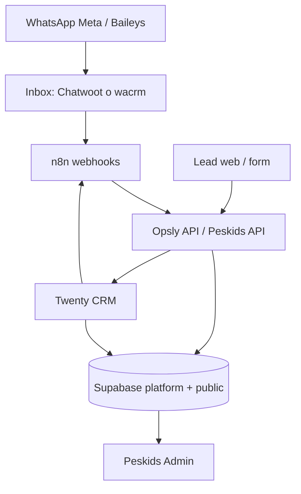

# Peskids — Open Source CRM Migration

Plan canónico para migrar de **GoHighLevel (GHL)** hacia un stack híbrido **WhatsApp-first** con herramientas open source, **sin romper producción**.

**Principios:** no reemplazar todo de una; GHL sigue como fallback; un solo write path por entidad; WhatsApp automático solo con aprobación humana; Peskids Admin no duplica CRM completo.

**Estado del documento:** `GATE_1_RECOVERED` (2026-07-06) · adapters preparados (`ADAPTERS_READY_NO_RUNTIME_CHANGE`).

---

## Gate 1 — Migration recovery (2026-07-06 UTC)

**Objetivo:** restaurar `POST /api/leads` → **201** en producción sin cambiar runtime provider flags.

### Root cause

- Error prod: `Could not find the 'ghl_contact_id' column of 'peskids_leads' in the schema cache`
- Clasificación: **MISSING_COLUMN** en `platform.peskids_leads`
- `0075` figuraba aplicada en `schema_migrations` pero el DDL GHL **no** estaba en la tabla (schema drift)

### Migraciones platform (`supabase/migrations`)

| Migration | Antes (prod) | Acción 2026-07-06 | Después |
|-----------|--------------|-------------------|---------|
| `0075` GHL tracking | Registrada, columnas ausentes | Reparado vía `0084` (mismo DDL idempotente) | `ghl_*` columnas OK |
| `0079` trial classes | Aplicada (histórico) | — | Sin cambio |
| `0080` session notes | Aplicada (histórico) | — | Sin cambio |
| `0081` intcloudsysops schema | Pendiente | `supabase db push` | Aplicada |
| `0082` Twenty CRM ids | Pendiente | `supabase db push` | `twenty_*` columnas OK |
| `0083` intcloudsysops CRM ids | Pendiente | `supabase db push` | Aplicada |
| `0084` repair GHL columns | N/A | `supabase db push` | Drift 0075 cerrado |

### Migración tenant `005_message_approval_status.sql`

- Vive en `apps/peskids/migrations/` (`public.messages` constraint)
- **No** bloquea lead capture; sigue pendiente de verificación/aplicación explícita para estados `pending_approval` / `skipped`

### Smoke producción (post-migración)

| Check | Resultado |
|-------|-----------|
| `GET https://peskids.op-sly.com/` | **200** |
| `GET https://api.op-sly.com/api/health` | **ok** |
| `POST https://peskids.op-sly.com/api/leads` | **201** |
| `POST https://api.op-sly.com/api/public/tenants/peskids/leads` | **201** |
| Fila en `platform.peskids_leads` | **OK** (`opsly.verify+migration-gate-*@intcloudsysops.com`) |
| `GET /api/admin/digest/daily` sin auth | **401** (esperado) |
| Provider flags (`PESKIDS_*_PROVIDER`) | **unset** — runtime legacy sin Twenty/Chatwoot |

### Próximo paso Gate 1 ops

1. Commitear `0084_repair_peskids_ghl_tracking_fields.sql` en `main` para alinear repo ↔ prod
2. Aplicar / verificar migración `005` en `public.messages` si aún falta
3. Configurar `PESKIDS_DIGEST_CRON_SECRET` + cron n8n 8am (`DAILY-DIGEST-RUNBOOK.md`)

---

## Phase 1 — Readiness audit (2026-07-05)

### 1. Qué vive hoy en GHL

| Área | En GHL hoy | En código / ops |
|------|------------|-----------------|
| Contactos | Sí — location `KJ5LawrOOe3hIerqtMRu` | `gohighlevel-lead-sync.ts`, `GhlSyncService`, `ghl_contact_id` en leads |
| Pipeline | Sí — oportunidades / stages | `pipeline.service.ts`, `pipeline-manager.service.ts`, `apps/api/lib/peskids/ghl-contract.ts` |
| Conversaciones | Sí — inbox GHL | `gohighlevel-thread-client.ts`; webhook `/api/webhooks/gohighlevel` (**disabled** si `PESKIDS_GHL_ENABLED=false`) |
| Calendario | Sí — trial booking | `trial-scheduler.service.ts` usa `ghl_contact_id` para calendar API |
| Automatizaciones | Sí — workflows UI GHL | Documentado en `GHL-WORKFLOWS.md` (manual UI, no en repo) |
| Custom fields | Sí — grade, modality, barrio | Mapeo en `GOHIGHLEVEL-CONTRACT.md` (deprecated → ver Twenty) |

**Flag actual:** `PESKIDS_GHL_ENABLED` default **false** (opt-in explícito). Producción puede seguir usando GHL vía flag + Doppler.

### 2. Qué vive hoy en Peskids / Opsly

| Área | Estado | Rutas / módulos |
|------|--------|-----------------|
| Leads | ✅ Live | `POST /api/leads`, admin leads, `peskids-platform-dashboard.ts` |
| Alumnos / familias | ✅ | `students`, portal familias, admin students |
| Clases / agenda | ✅ | `classes`, `trial_classes`, calendar migrations |
| Follow-ups | ✅ | `followups`, agents `lead-followup.service.ts`, platform `0072` columns |
| Mensajes WhatsApp | ✅ approval-first | `/admin/messages`, `message-reply-handler.ts`, migration `005` |
| Dashboard | ✅ | `dashboard.service.ts`, digest `GET /api/admin/digest/daily` |
| Referrals | ✅ | migrations `006`, `0078` |

### 3. Qué vive hoy en Supabase

**Schema `platform.*` (Opsly API):**

| Tabla / campos | Migración | Notas |
|----------------|-----------|-------|
| `platform.peskids_leads` | `0053`, `0071`, `0075`, `0082` | `ghl_*`, `twenty_*`, stage, followup cols |
| `platform.peskids_messages` | `0073` | Mensajes approval-first |
| `platform.peskids_feedback` | `0053` | Feedback landing |

**Schema `public.*` (app Peskids):**

| Tabla | Migración app | Notas |
|-------|---------------|-------|
| `leads`, `students`, `parents` | `001`, `011` | `ghl_contact_id` tenant-side |
| `messages` | `002`, `004`, `005` | Hilos + estados aprobación |
| `followups` | `001` | Digest n8n |
| `trial_classes` | `20260609`, `0079` | Clase de prueba |
| `classes`, payments | `009` | Operaciones academia |

**Dual schema:** leads existen en `platform.peskids_leads` (canonical API) y `public.leads` (n8n legacy capture). Sincronizar en cutover.

### 4. Qué vive hoy en n8n (`n8n_peskids`)

| Workflow | Archivo | Estado |
|----------|---------|--------|
| Lead capture landing | `peskids-lead-capture.json` | Activo en pack |
| Lead intake GHL envelope | `peskids-lead-intake.json` | Dedupe, sin DB write |
| Hot lead alert | `hot-lead-alert.json` | Discord |
| Follow-up pending digest | `peskids-followup-pending.json` | 8am — complementa API digest |
| Follow-up 24h auto | `peskids-followup-24h.json` | **`active: false`** |
| Message pipeline | `message-pipeline.json` | Inbound notify |
| Send approved WA | `send-approved.json` | Solo tras aprobación admin |
| WA / IG receivers | `whatsapp-receiver.json`, etc. | Ingress legacy |

Instalador: `scripts/install-peskids-n8n-workflows.sh` · Guía: `N8N-WORKFLOWS-GUIDE.md`

### 5. Qué reemplazaría **Chatwoot** (objetivo estratégico)

| Función GHL / actual | Chatwoot target |
|----------------------|-----------------|
| WhatsApp inbox comercial | Inbox omnicanal Chatwoot |
| Conversación con padres | Threads + agent assignment |
| Asignación staff | Teams / inboxes |
| Estado conversación | Labels + status |
| Templates | Canned responses (manual/aprobados) |

**Nota repo (2026-06-09):** **wacrm** es el inbox WhatsApp OSS oficial para Peskids (`POST /api/webhooks/wacrm`, `PESKIDS_INBOX_PROVIDER=wacrm`). Chatwoot queda como alternativa futura no desplegada. Ver `WACRM-RUNBOOK.md`.

### 6. Qué reemplazaría **Twenty / EspoCRM**

| Función GHL | Twenty (preferido en repo) | EspoCRM (alternativa) |
|-------------|----------------------------|------------------------|
| Pipeline comercial | Opportunities + stages | Leads/Opportunities |
| Contactos comerciales | People | Contacts |
| Owners | Workspace members | Users |
| Seguimiento venta | Stage sync vía API | Workflow rules |

**Estado Twenty:** cliente `@intcloudsysops/services/twenty`, sync en `twenty-lead-sync.ts`, compose `infra/docker-compose.twenty.yml` — **VPS deploy pendiente** (`TWENTY-CRM.md`).

### 7. Qué reemplazaría **Cal.com**

| Función GHL | Cal.com target |
|-------------|----------------|
| Booking clase de prueba | Event type + availability |
| Links de reserva | Public booking URL |
| Webhook post-booking | n8n → Opsly → `trial_classes` |

**Estado:** no implementado; `trial-scheduler.service.ts` usa GHL calendar cuando hay `ghl_contact_id`.

---

## Phase 2 — Target architecture



**Reglas:**

- **Supabase + Opsly API** = fuente operativa (alumnos, clases, mensajes, audit).
- **Inbox (Chatwoot/wacrm)** = conversación; no duplicar texto completo en Twenty.
- **Twenty/EspoCRM** = pipeline comercial; no reimplementar kanban en Peskids.
- **Peskids Admin** = vistas agregadas + aprobación mensajes; enlaces deep-link al CRM/inbox.
- **n8n** = glue (digest, alertas, sync notes-only a Twenty).

---

## Phase 3 — Migration plan (gradual)

| Step | Objetivo | Estado repo |
|------|----------|-------------|
| **1 — GHL bridge visible** | `ghl_contact_id`, sync status, abrir contacto GHL | Adapters: `resolveCrmContactLinks()` · UI admin pendiente |
| **2 — wacrm inbox** | Webhook `POST /api/webhooks/wacrm`, admin visibility, digest | ✅ Código · activar flags tras smoke |
| **2b — Chatwoot pilot** | Alternativa futura (no instalar ahora) | ❌ No instalado |
| **3 — CRM OSS pilot** | Twenty pipeline + import QA leads | Código ✅ · VPS ❌ |
| **4 — Cal.com pilot** | Booking clase prueba | ❌ |
| **5 — Cutover controlado** | GHL fallback 1–2 semanas, apagar progresivo | Runbook: `PESKIDS-GHL-DISABLE-RUNBOOK.md` |

---

## Phase 4 — Field mapping matrix

| Concepto | GHL | Supabase | Chatwoot | Twenty | wacrm (alt.) | n8n workflow | Owner |
|----------|-----|----------|----------|--------|--------------|--------------|-------|
| Lead nombre | contact.name | `peskids_leads.name`, `leads.name` | contact name | Person.name | chat contact | `peskids-lead-capture` | Opsly API |
| Email | contact.email | `email` | — | Person.email | — | same | Opsly API |
| Teléfono | contact.phone | `phone` | phone_number | Person.phone | wa_id | same | Opsly API |
| Grado interés | custom field | `grade_interested` | — | custom / note | — | intake | Peskids app |
| Modalidad | custom field | `class_modality` | — | note | — | intake | Peskids app |
| Barrio | custom field | `neighborhood` | — | note | — | intake | Peskids app |
| Stage pipeline | opportunity.stage | `stage` | — | Opportunity.stage | — | `pipeline-manager` | Twenty |
| GHL IDs | contact.id | `ghl_contact_id`, `ghl_opportunity_id` | — | — | — | `peskids-lead-intake` | Legacy |
| Twenty IDs | — | `twenty_person_id`, `twenty_opportunity_id` | — | person/opportunity id | linked note | `wacrm-inbound-twenty-note` | Twenty sync |
| Mensaje WA | conversation | `messages`, `peskids_messages` | conversation | note (summary only) | thread | `message-pipeline` | Peskids admin |
| Follow-up | task / workflow | `followups`, followup cols | — | task (future) | — | `peskids-followup-pending` | n8n + digest API |
| Trial class | calendar event | `trial_classes` | — | — | — | manual / future Cal.com | Admin |
| Referral | tag | `referrals` | label | tag | — | — | Peskids |

---

## Feature flags (unified providers)

Documented defaults for **explicit cutover** (when unset, runtime stays **legacy** — no production change):

| Variable | Valores | Default documentado | Runtime sin flag |
|----------|---------|---------------------|------------------|
| `PESKIDS_CRM_PROVIDER` | `ghl` \| `twenty` \| `espocrm` | `ghl` | `legacy` → Twenty if configured + GHL if `PESKIDS_GHL_ENABLED` |
| `PESKIDS_INBOX_PROVIDER` | `ghl` \| `chatwoot` \| `wacrm` | `wacrm` (recomendado explícito) | `legacy` → inbound/jelou/openwa webhooks |
| `PESKIDS_BOOKING_PROVIDER` | `ghl` \| `calcom` | `ghl` | `legacy` → GHL calendar en trial scheduler |

**Flags existentes (siguen activos):**

- `PESKIDS_GHL_ENABLED` — default `false`
- `PESKIDS_TWENTY_ENABLED` — default `true` when URL+key set
- `WACRM_PESKIDS_ENABLED` — default `false`

**Código:** `apps/peskids/lib/integrations/peskids-provider-config.ts`, `peskids-provider-adapters.ts`, `peskids-crm-sync.ts`

---

## Phase 5 — Validation checklist

| Check | Criterio |
|-------|----------|
| Lead capture | `POST /api/leads` → **201** sin flags nuevos |
| Admin leads | Dashboard carga leads |
| GHL sync | Sin cambio mientras `PESKIDS_GHL_ENABLED=false` |
| Approval-first WA | Sin auto-send (`PESKIDS_WHATSAPP_REPLY_MODE=approval-first`) |
| Tests | `peskids-provider-config.test.ts` + suite existente |

```bash
npm run test --workspace=@intcloudsysops/peskids -- lib/__tests__/peskids-provider-config.test.ts
npm run type-check --workspace=@intcloudsysops/peskids
```

---

## Qué tenemos vs qué falta (instalación)

### ✅ Ya en repo / producción

- Lead capture live + Supabase canonical
- Approval-first messaging + daily digest API (Week 2)
- Twenty CRM client + lead sync code
- GHL legacy aislado detrás de flags
- wacrm channel module (alternativa inbox OSS)
- n8n workflow pack + install script
- Migraciones GHL + Twenty IDs
- Documentación Twenty, wacrm, GHL disable runbooks

### ❌ Falta instalar / operar (no tocar prod aún)

| Componente | Acción |
|------------|--------|
| **Twenty CRM VPS** | `./scripts/tenants/setup-twenty-peskids.sh`, DNS `crm-peskids.op-sly.com` |
| **Chatwoot** | Nuevo compose + Meta WA sandbox + webhook n8n |
| **EspoCRM** | Solo si Twenty no cumple — evaluación pendiente |
| **Cal.com** | Step 4 — solo si reemplazan calendario GHL |
| **Migration 005 messages** | Aplicar en Supabase prod si no aplicada |
| **Digest cron n8n** | `PESKIDS_DIGEST_CRON_SECRET` + workflow 8am |
| **Admin UI bridge** | Mostrar links GHL/Twenty usando `resolveCrmContactLinks` |
| **Chatwoot adapter route** | `/api/webhooks/chatwoot` (stub documentado) |

---

## Enlaces relacionados

- [TWENTY-CRM.md](./TWENTY-CRM.md)
- [WACRM-TWENTY-CUTOVER.md](./WACRM-TWENTY-CUTOVER.md)
- [DAILY-DIGEST-RUNBOOK.md](./DAILY-DIGEST-RUNBOOK.md)
- [N8N-WORKFLOWS-GUIDE.md](./N8N-WORKFLOWS-GUIDE.md)
- [GOHIGHLEVEL-CONTRACT.md](./GOHIGHLEVEL-CONTRACT.md) (deprecated)
- [../../blueprints/PESKIDS-GHL-MIGRATION-STATUS.md](../../blueprints/PESKIDS-GHL-MIGRATION-STATUS.md)
- [../../blueprints/TWENTY-CRM-CUTOVER-CHECKLIST.md](../../blueprints/TWENTY-CRM-CUTOVER-CHECKLIST.md)
