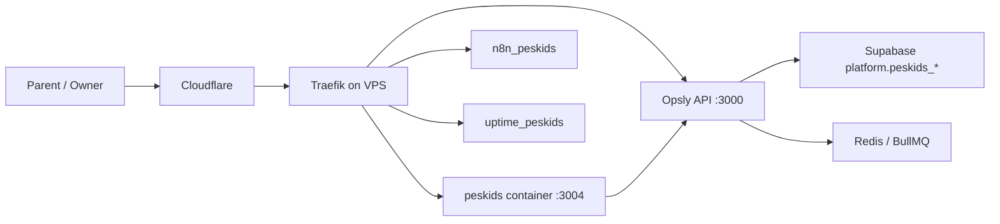

# Peskids Production Hardening Blueprint

Status: draft generated with The Architect on 2026-05-21.

## 1. Goal

Make Peskids a production-grade tenant app running on Opsly infrastructure, with no Vercel dependency, reliable lead/feedback capture, owner visibility, and a clear path to a future standalone `peskids-platform`.

## 2. Current Production Shape



## 3. Production URLs

| Surface | URL | Status |
| --- | --- | --- |
| Peskids app | `https://peskids.op-sly.com` | Active |
| Public lead form fallback | `https://api.op-sly.com/peskids/lead-form.html` | Active |
| Public feedback form fallback | `https://api.op-sly.com/peskids/feedback-form.html` | Active |
| API health | `https://api.op-sly.com/api/health` | Active |
| n8n | `https://n8n-peskids.op-sly.com` | Active |
| Uptime Kuma | `https://uptime-peskids.op-sly.com` | Active |

## 4. Data Model

Canonical production tables:

- `platform.peskids_leads`
- `platform.peskids_feedback`

Deprecated app-local assumptions:

- `public.leads`
- `public.feedback`
- `public.students`
- `public.followups`
- `public.messages`

The Peskids app should either proxy writes to Opsly API or be migrated fully to the canonical `platform.peskids_*` tables. Do not maintain two write paths.

## 5. API Design

Canonical public writes:

- `POST /api/public/tenants/peskids/leads`
- `POST /api/public/tenants/peskids/feedback`

App-local proxy routes:

- `POST https://peskids.op-sly.com/api/leads`
- `POST https://peskids.op-sly.com/api/feedback`

Owner routes to add:

- `GET /api/portal/tenant/peskids/peskids/summary`
- `GET /api/portal/tenant/peskids/peskids/leads`
- `GET /api/portal/tenant/peskids/peskids/feedback`

## 6. Frontend

Keep the first production UI small:

- Public landing page.
- Lead capture form.
- Feedback form.
- Thank-you page.
- Owner dashboard summary using portal JWT, not a static admin cookie.

## 7. Deployment

Production deployment must stay on Opsly:

- VPS Docker container `peskids`.
- Image `ghcr.io/cloudsysops/peskids:latest`.
- Traefik dynamic router `peskids.op-sly.com`.
- Runtime env file `/opt/opsly/runtime/peskids.env`.

No Vercel dependency for the production pilot.

## 8. Security Rules

- No secrets in repo.
- Public routes only accept validated lead/feedback payloads.
- Owner dashboard must require portal JWT and tenant slug match.
- n8n workflow activation requires explicit operator action.
- Cyber Neo secret scans should summarize findings only; do not paste raw matched values.

## 9. Build Order

1. Stabilize `apps/peskids` Docker build with lockfile and reproducible installs.
2. Keep `/api/leads` and `/api/feedback` proxying to Opsly API until app schema is migrated.
3. Replace app-local dashboard API with Opsly portal-authenticated summary API.
4. Add smoke script for `https://peskids.op-sly.com` root, lead proxy, and feedback proxy.
5. Add Uptime Kuma monitors for root, API health, lead form, feedback form, n8n, and uptime.
6. Import CRM workflows into n8n after owner approval.
7. Add backup/export runbook for Peskids leads and feedback.
8. Decide extraction threshold for `peskids-platform`.

## 10. Validation

Required before declaring a release:

```bash
npm run build --workspace=peskids
API_BASE=https://api.op-sly.com ./scripts/peskids-mvp-smoke.sh
curl -fsS https://peskids.op-sly.com/
curl -fsS https://api.op-sly.com/api/health
```

## 11. Builder Instructions

- Work in small slices.
- Do not move Peskids to Vercel.
- Do not bypass Opsly API for production writes unless the new direct path uses the same canonical schema and auth rules.
- Keep n8n workflow activation manual until credentials and notifications are confirmed.
- Commit Peskids hardening separately from unrelated agent/vendor imports.

---

## Enlaces relacionados

- [[tenants/peskids/README|peskids]]
- [[brain/README|Brain Central]]
