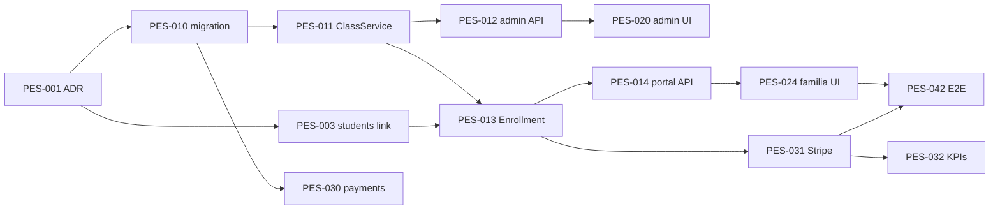

# Peskids — Sprint backlog: Operación (Opción 1)

> **Formato:** issues listos para `gh issue create` o import Linear.  
> **Epic label:** `peskids:operations`  
> **Sprint 0:** prep · **Sprint 1–2:** clases · **Sprint 3:** pagos · **Sprint 4:** notificaciones + hardening

**Total estimado:** 18–22 días dev (1 senior) + 3 días QA/buffer

---

## Leyenda

| Campo | Significado |
|-------|-------------|
| **Pts** | Story points (1 ≈ 0.5 día) |
| **Deps** | Issue IDs bloqueantes |
| **Labels** | `peskids`, `backend`, `frontend`, `infra`, `qa` |

---

## Sprint 0 — Preparación (2–3 días)

### PES-001 — ADR + revisión migración clases/pagos

**Labels:** `peskids`, `docs`, `security`  
**Pts:** 2  
**Deps:** —

**Descripción:**  
Documentar decisión schema `peskids.*`, RLS, Stripe COP, link `students` ↔ familia auth. Revisión humana antes de `db push` prod.

**AC:**

- [ ] ADR en `docs/adr/` o sección en CLASSES-SYSTEM-SPEC aprobada
- [ ] Checklist AGENT-GUARDRAILS marcado
- [ ] Owner confirma piscinas/niveles seed

---

### PES-002 — Seed data pools + niveles UI

**Labels:** `peskids`, `backend`  
**Pts:** 2  
**Deps:** PES-001

**Descripción:**  
Script idempotente `scripts/seed-peskids-pools.sh --dry-run` insertando piscinas Llanogrande + mapping niveles 1–6 a labels Tiburones/Delfines.

**AC:**

- [ ] Seed ejecutable en staging
- [ ] Documentado en OPS-RUNBOOK

---

### PES-003 — Vincular students ↔ family_user_id

**Labels:** `peskids`, `backend`, `security`  
**Pts:** 3  
**Deps:** PES-001

**Descripción:**  
Hoy `public.students` tiene `parent_email` pero no FK a auth. Añadir columna `family_user_id uuid` nullable + backfill desde leads convertidos.

**AC:**

- [ ] Migración + índice
- [ ] Portal enrollment valida student pertenece a familia logueada

---

## Sprint 1 — Backend clases (4–5 días)

### PES-010 — Migración 009 classes/enrollments/pools

**Labels:** `peskids`, `backend`, `security`  
**Pts:** 3  
**Deps:** PES-001

**AC:**

- [ ] SQL en `apps/peskids/migrations/009_*.sql`
- [ ] RLS policies: staff read/write; familia read own enrollments
- [ ] `supabase db push --dry-run` OK

---

### PES-011 — ClassService CRUD + overlap validation

**Labels:** `peskids`, `backend`  
**Pts:** 5  
**Deps:** PES-010

**Archivos:** `lib/services/class.service.ts`, `lib/validation/class.schema.ts`

**AC:**

- [ ] create / update / cancel / listByRange
- [ ] Rechaza overlap profesor y over-capacity pool
- [ ] Vitest ≥ 8 casos

---

### PES-012 — GET/POST/PATCH /api/admin/classes

**Labels:** `peskids`, `backend`  
**Pts:** 3  
**Deps:** PES-011

**AC:**

- [ ] Auth admin para mutaciones; teacher read own
- [ ] `request_id` en todas las respuestas
- [ ] Tests route con mocks Supabase

---

### PES-013 — EnrollmentService reservar/cancelar

**Labels:** `peskids`, `backend`  
**Pts:** 5  
**Deps:** PES-011, PES-003

**AC:**

- [ ] POST reserva con lock optimista cupos
- [ ] DELETE cancel 24h rule
- [ ] Vitest casos: lleno, duplicado, cancel tarde

---

### PES-014 — Portal API classes + enrollments

**Labels:** `peskids`, `backend`  
**Pts:** 3  
**Deps:** PES-013

**Rutas:** `/api/portal/classes`, `/api/portal/enrollments`

**AC:**

- [ ] Solo clases futuras scheduled con cupos
- [ ] 403 si student no es del usuario

---

## Sprint 2 — Frontend clases (4–5 días)

### PES-020 — Admin panel #classes (lista)

**Labels:** `peskids`, `frontend`  
**Pts:** 5  
**Deps:** PES-012

**AC:**

- [ ] Nav item en admin-shell
- [ ] Lista semanal + filtros profesor/nivel
- [ ] Empty state + loading/error (patrón dashboard)

---

### PES-021 — Wizard crear/editar clase

**Labels:** `peskids`, `frontend`  
**Pts:** 5  
**Deps:** PES-020

**AC:**

- [ ] 3 pasos según wireframe spec
- [ ] Muestra error overlap inline
- [ ] Mobile usable

---

### PES-022 — Detalle clase + inscritos

**Labels:** `peskids`, `frontend`  
**Pts:** 3  
**Deps:** PES-020

**AC:**

- [ ] Tabla inscritos + payment_status
- [ ] Botón cancelar clase (admin)

---

### PES-023 — Teacher dashboard datos reales

**Labels:** `peskids`, `frontend`  
**Pts:** 3  
**Deps:** PES-012

**AC:**

- [ ] Eliminar dependencia de `teacher-weekly-static-data.ts`
- [ ] Página attendance por class id

---

### PES-024 — Portal familia /familias/clases

**Labels:** `peskids`, `frontend`  
**Pts:** 5  
**Deps:** PES-014

**AC:**

- [ ] Requiere login familia existente
- [ ] Reservar flujo → redirect checkout (stub OK hasta PES-030)
- [ ] `/familias/reservas` historial

---

## Sprint 3 — Pagos (3–4 días)

### PES-030 — Migración payments + PaymentService

**Labels:** `peskids`, `backend`  
**Pts:** 3  
**Deps:** PES-010

**AC:**

- [ ] Tabla `peskids.payments`
- [ ] createCheckoutSession(enrollment_id)

---

### PES-031 — Stripe checkout + webhook

**Labels:** `peskids`, `backend`, `infra`  
**Pts:** 5  
**Deps:** PES-030, PES-013

**AC:**

- [ ] `POST /api/payments/checkout`
- [ ] `POST /api/webhooks/stripe` verifica signature
- [ ] Idempotencia webhook
- [ ] Vars en Doppler documentadas

---

### PES-032 — Dashboard KPIs operación + finanzas

**Labels:** `peskids`, `backend`, `frontend`  
**Pts:** 3  
**Deps:** PES-030

**AC:**

- [ ] Extender `/api/dashboard` payload
- [ ] Cards en dashboard-view: ingresos mes, clases hoy, pendientes

---

### PES-033 — Admin marcar pago manual (fallback)

**Labels:** `peskids`, `frontend`  
**Pts:** 2  
**Deps:** PES-030

**AC:**

- [ ] Solo owner/admin
- [ ] Audit log entry (reuse audit pattern si existe)

---

## Sprint 4 — Notificaciones + QA (3–4 días)

### PES-040 — Eventos notificación clases/pagos

**Labels:** `peskids`, `backend`  
**Pts:** 3  
**Deps:** PES-013, PES-031

**AC:**

- [ ] Tipos en notification_preferences
- [ ] enqueue on enrollment_confirmed, class_cancelled

---

### PES-041 — n8n workflow recordatorio 24h

**Labels:** `peskids`, `infra`  
**Pts:** 3  
**Deps:** PES-040

**AC:**

- [ ] Workflow JSON en docs/n8n o `.n8n/`
- [ ] Guía import en N8N-WORKFLOWS-GUIDE
- [ ] Dry-run en staging

---

### PES-042 — E2E smoke operaciones

**Labels:** `peskids`, `qa`  
**Pts:** 3  
**Deps:** PES-024, PES-031

**AC:**

- [ ] `scripts/test-peskids-operations-e2e.sh`
- [ ] Documentado en CLIENT-DEMO-CHECKLIST
- [ ] CI optional job

---

### PES-043 — OpenAPI subset clases (opcional)

**Labels:** `peskids`, `docs`  
**Pts:** 2  
**Deps:** PES-012

**AC:**

- [ ] Paths en openapi tenant o stub opsly-api si aplica

---

## Sprint 5 — Opción 2 (backlog congelado)

| ID | Título | Pts |
|----|--------|-----|
| PES-050 | StudentEvaluation schema + API | 8 |
| PES-051 | UI /familias/progreso radar chart | 5 |
| PES-052 | ReferralProgram completar (post-lead) | 5 |
| PES-053 | PWA manifest + push (extend 008) | 5 |
| PES-054 | Calendario admin FullCalendar | 5 |
| PES-055 | class_series recurrencia | 8 |

---

## Grafo de dependencias



---

## Comandos GitHub CLI (batch create)

```bash
# Ejemplo — repetir por issue con body desde este doc
gh issue create \
  --repo cloudsysops/opsly \
  --title "[Peskids] PES-011 ClassService CRUD + overlap validation" \
  --label "peskids,backend" \
  --body "Ver docs/tenants/peskids/SPRINT-BACKLOG-OPERATIONS-2026.md#issue-pes-011"
```

**Milestone sugerido:** `Peskids Operations MVP — 2026-Q2`

---

## Definition of Done (epic)

- [ ] Owner crea 5 clases reales en staging
- [ ] 1 reserva + pago test Stripe completado
- [ ] 1 docente marca asistencia
- [ ] 1 recordatorio email recibido
- [ ] PR mergeado a `main` + deploy VPS
- [ ] CLIENT-DECK actualizado con fecha go-live

---

## Enlaces

- [CLASSES-SYSTEM-SPEC.md](./CLASSES-SYSTEM-SPEC.md)
- [CLIENT-DECK-OPERATIONS-2026-05.md](./CLIENT-DECK-OPERATIONS-2026-05.md)
