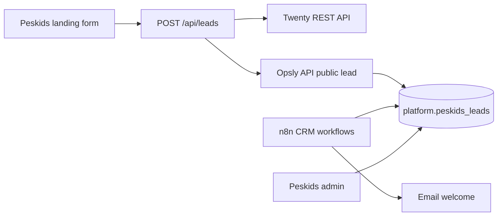

# Peskids — Twenty CRM (reemplazo de GoHighLevel)

## Objetivo

Migrar el CRM comercial de **GoHighLevel (SaaS de pago)** a **Twenty CRM** (open source, self-hosted en el VPS Opsly), manteniendo:

- Captura de leads en Supabase (`platform.peskids_leads`) como fuente operativa
- Automatización vía **n8n CRM Starter Pack** + **Resend**
- Operaciones (clases, familias, docentes) en la app Peskids

## Estado en repo (2026-06-09)

| Componente | Estado |
|-----------|--------|
| Cliente `@intcloudsysops/services/twenty` | Implementado en `lib/services/twenty/` |
| Sync al crear lead (`POST /api/leads`) | `syncLeadToCrm()` → Twenty si está configurado |
| GoHighLevel sidecar | **Desactivado por defecto** — requiere `PESKIDS_GHL_ENABLED=true` |
| Migración DB | `0082_peskids_twenty_crm_ids.sql` (`twenty_person_id`, `twenty_opportunity_id`) |
| Compose VPS | `infra/docker-compose.twenty.yml` |
| Instancia prod | **Pendiente** — no hay contenedor Twenty en VPS (verificado 2026-06-09) |

## Arquitectura



## Despliegue Twenty en VPS

### 1. Secretos Doppler (`ops-intcloudsysops/prd`)

```bash
# URL pública (Traefik)
doppler secrets set TWENTY_SERVER_URL="https://crm-peskids.op-sly.com" --project ops-intcloudsysops --config prd

# Generar (no reutilizar en chat):
openssl rand -base64 32   # TWENTY_APP_SECRET
openssl rand -base64 32   # TWENTY_ENCRYPTION_KEY
openssl rand -base64 24   # TWENTY_PG_PASSWORD

doppler secrets set TWENTY_APP_SECRET="..." TWENTY_ENCRYPTION_KEY="..." TWENTY_PG_PASSWORD="..." \
  --project ops-intcloudsysops --config prd
```

Regenerar `.env` en VPS (`./scripts/vps-bootstrap.sh`) y levantar:

```bash
./scripts/tenants/setup-twenty-peskids.sh
```

### 2. DNS

Añadir registro `crm-peskids.op-sly.com` → Cloudflare proxy ON (misma IP VPS).

### 3. API key Twenty → Peskids

Tras crear workspace admin en Twenty:

```bash
doppler secrets set \
  TWENTY_API_URL="https://crm-peskids.op-sly.com" \
  TWENTY_API_KEY="..." \
  PESKIDS_TWENTY_ENABLED="true" \
  PESKIDS_GHL_ENABLED="false" \
  --project ops-intcloudsysops --config prd
```

Redeploy contenedor `peskids` + `app` (API).

### 4. Migración Supabase

```bash
npx supabase db push   # aplica 0082_peskids_twenty_crm_ids.sql
```

## Variables de entorno (app Peskids)

| Variable | Descripción |
|----------|-------------|
| `TWENTY_API_URL` | Base URL self-hosted (ej. `https://crm-peskids.op-sly.com`) |
| `TWENTY_API_KEY` | Bearer token desde Twenty Settings |
| `PESKIDS_TWENTY_ENABLED` | Default `true` si hay URL+key; `false` para pausar sync |
| `PESKIDS_GHL_ENABLED` | Default `false`; `true` solo durante dual-write temporal |
| `TWENTY_DEFAULT_OPPORTUNITY_STAGE` | Stage inicial (default `NEW`) |

## Pipeline sugerido (Twenty)

| Supabase `status` | Twenty opportunity stage |
|-------------------|--------------------------|
| `new` | NEW |
| `contacted` | SCREENING |
| `trial` | MEETING |
| `enrolled` | CUSTOMER |
| `active` | CUSTOMER |
| `renewal` | CUSTOMER |
| `archived` | LOST |

Ajustar stages según el workspace creado en Twenty (Settings → Objects → Opportunities).

## Import desde GoHighLevel

1. Exportar contactos CSV desde GHL antes de cancelar suscripción
2. Twenty → Import → People
3. Crear oportunidades manualmente o vía script (fase 2)

## n8n CRM pack

```bash
./scripts/install-crm-workflows.sh --tenant peskids --dry-run
./scripts/install-crm-workflows.sh --tenant peskids
```

Ver `.n8n/1-workflows/crm/` y `docs/n8n-workflows/crm/README.md`.

## Deprecación GHL

- Contrato legacy: [`GOHIGHLEVEL-CONTRACT.md`](GOHIGHLEVEL-CONTRACT.md) — no usar para nuevos flujos
- Webhooks GHL pueden permanecer hasta completar import; desactivar cuando Twenty esté estable

## Verificación

```bash
# Lead capture (requiere form o curl con consent)
curl -sfk -X POST "https://peskids.op-sly.com/api/leads" \
  -H "Content-Type: application/json" \
  -d '{"name":"Test Lead","email":"test@example.com","grade_interested":"K-5","consent_treatment":true}'

# Respuesta incluye twenty_person_id cuando Twenty está configurado

# Smoke Twenty (no exige IDs salvo TWENTY_SMOKE_EXPECT_IDS=true)
./scripts/peskids/twenty-crm-smoke.sh --base-url "https://peskids.op-sly.com"
```

Tests unitarios:

```bash
npm run test --workspace=@intcloudsysops/services -- twenty
npm run test --workspace=peskids -- lead-followup trial-scheduler pipeline-manager pipeline-rules
npm run type-check --workspace=peskids
```

## Checklist cutover — apagado GoHighLevel

Ejecutar en orden tras merge de `feat/peskids-twenty-crm` y smoke verde en staging.

### Pre-requisitos (repo + VPS)

| # | Verificación | Comando / evidencia |
|---|----------------|---------------------|
| 1 | Migración `0082` aplicada en Supabase | `npx supabase db push --dry-run` → incluye `twenty_person_id` / `twenty_opportunity_id` |
| 2 | Compose Twenty en repo | `infra/docker-compose.twenty.yml` |
| 3 | Script instalación | `./scripts/tenants/setup-twenty-peskids.sh --dry-run` |
| 4 | Secretos Twenty generados | `./scripts/tenants/generate-twenty-secrets.sh` (solo local; no commitear) |
| 5 | Agentes locales (sin GHL operativo) | follow-up, trial scheduler y pipeline leen `public.leads` / `trial_classes` |

### Doppler (`ops-intcloudsysops/prd`)

| Variable | Valor cutover |
|----------|----------------|
| `TWENTY_API_URL` | `https://crm-peskids.op-sly.com` (o URL real) |
| `TWENTY_API_KEY` | Bearer desde Twenty Settings |
| `PESKIDS_TWENTY_ENABLED` | `true` |
| `PESKIDS_GHL_ENABLED` | `false` |
| `TWENTY_SERVER_URL` | Misma base que API pública Twenty |

Opcional durante dual-write temporal: `PESKIDS_GHL_ENABLED=true` — **no** usar para nuevos flujos; solo import histórico.

### Despliegue humano (VPS)

1. `cd /opt/opsly && git pull --ff-only` (rama mergeada)
2. `./scripts/vps-bootstrap.sh` — regenerar `.env`
3. `./scripts/tenants/setup-twenty-peskids.sh`
4. DNS `crm-peskids.op-sly.com` → proxy ON
5. Twenty UI: workspace admin + API key + stages de oportunidad alineados a tabla pipeline arriba
6. `docker compose … pull && up -d peskids app` (según runbook deploy)
7. `./scripts/peskids/twenty-crm-smoke.sh`
8. Crear lead de prueba → confirmar `twenty_person_id` en respuesta y fila en `platform.peskids_leads`

### Apagado GHL (final)

| # | Acción |
|---|--------|
| 1 | Export CSV contactos GHL (archivo fuera del repo) |
| 2 | Import People en Twenty |
| 3 | Desactivar webhooks GHL → `apps/peskids/app/api/webhooks/gohighlevel` (ver [`GOHIGHLEVEL-CONTRACT.md`](GOHIGHLEVEL-CONTRACT.md)) |
| 4 | Confirmar `PESKIDS_GHL_ENABLED=false` en Doppler prd |
| 5 | Redeploy Peskids; verificar que agentes no llaman `getContacts` / calendar GHL |
| 6 | Cancelar suscripción GHL tras periodo de gracia |

### Criterio de done (migración código)

- Lead capture → Supabase + Twenty (GHL opcional legacy)
- Follow-up, trial booking y pipeline avanzan con datos locales
- GHL limitado a webhooks/sync legacy documentados
- Este checklist completado en ops antes de cancelar GHL

## Enlaces

- Twenty docs: https://docs.twenty.com/developers/extend/api
- WhatsApp sin GHL: [`WHATSAPP-CHANNEL.md`](WHATSAPP-CHANNEL.md)
- Release 3 agenda: smoke `scripts/peskids/release3-agenda-smoke.sh`
