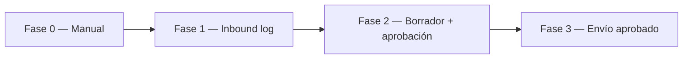

# Peskids — canal WhatsApp

Plan operativo y técnico para **manejar WhatsApp** en Peskids sin romper **approval-first** ni mezclar con integraciones de otros productos (Local Services / Twilio, GoHighLevel auto-send).

## Qué NO usamos para Peskids

| En el repo | Por qué no aplica tal cual |
|------------|----------------------------|
| [ADR-039](../../adr/ADR-039-sales-channels-email-whatsapp.md) | Local Services (US), Twilio, Sales Agent con auto-reply |
| Rama `gohighlevel-ai-integration` | Envía WhatsApp **sin** aprobación previa |
| Sprint 01 | Sin API de mensajería; solo diseño de forms + dashboard |

## Decisión de proveedor (recomendación)

| Opción | Cuándo elegir | Lock-in |
|--------|---------------|---------|
| **Meta WhatsApp Cloud API** | Owner ya tiene Business verificado; equipo cómodo con Meta | Medio |
| **Jelou** | LATAM, menos fricción operativa, soporte regional | Medio–alto |
| **GoHighLevel** | Solo si el owner **ya paga** GHL y no quiere otro stack | Alto — evitar si no es obligatorio |

**Recomendación por defecto (Colombia/LATAM):** evaluar **Jelou** vs **Meta directo** con el owner; documentar la elección en este archivo antes de activar webhooks.

**Cuenta:** siempre a nombre del **cliente** (Meta Business + número). Opsly: acceso delegado revocable.

## Fases

### Fase 0 — Manual (ahora, Sprint 01)

- Padres escriben al WhatsApp Business del owner.
- Leads entran por **formulario web** → dashboard / follow-up.
- El owner **copia/pega** plantillas; no hay bot.
- Problema que resolvemos después: mensajes no quedan en el sistema.

**Listo cuando:** owner confirma número y horario de atención.

### Fase 1 — Inbound documentado (MVP+1)

**Objetivo:** registrar conversaciones sin responder automáticamente.

| Paso | Detalle |
|------|---------|
| Webhook | Proveedor → n8n `tenant_peskids` |
| Guardar | Tabla `whatsapp_messages` o ampliar `leads` con `source: whatsapp` |
| Evento | `whatsapp.message.received` (ver [EVENT-CONTRACT.md](./EVENT-CONTRACT.md)) |
| UI | Cola “Mensajes WhatsApp” en dashboard (solo lectura + link a chat) |
| Prohibido | Auto-reply “gracias por escribir” sin texto fijo pre-aprobado por owner |

### Fase 2 — Borrador IA (opcional)

- IA genera **borrador** de respuesta (`draft`).
- Owner edita en dashboard.
- Estados: `draft` → `approved` → `sent` ([AI-APPROVAL-POLICY.md](./AI-APPROVAL-POLICY.md)).
- LLM solo vía **LLM Gateway** con `tenant_slug: peskids`.

### Fase 3 — Envío tras aprobación

- Nodo n8n o API **solo** cuando `status = approved` y `approved_by` registrado.
- Plantillas Meta para mensajes **iniciados por negocio** (fuera ventana 24h).
- Costos **pass-through** al cliente.

## Workflow n8n objetivo: `peskids-whatsapp-inbound`

| Campo | Valor |
|-------|--------|
| **Trigger** | Webhook Jelou/Meta (POST) |
| **Entrada** | `from`, `body`, `timestamp`, `message_id` |
| **Pasos** | Validar firma → dedupe por `message_id` → insert log → emit event → notificar dashboard (no email auto Sprint 01) |
| **Salida** | `whatsapp.message.received` |
| **IA** | Opcional: clasificar intención → metadata, **sin** enviar |

Workflow futuro: `peskids-whatsapp-send-approved` (solo tras aprobación humana).

## Secretos (Doppler `prd`, nunca en repo)

Nombres orientativos (ajustar al proveedor elegido):

- `PESKIDS_WHATSAPP_PROVIDER` — `jelou` \| `meta`
- `PESKIDS_WHATSAPP_WEBHOOK_SECRET`
- `PESKIDS_WHATSAPP_API_TOKEN` / credenciales Jelou
- `PESKIDS_WHATSAPP_PHONE_NUMBER_ID` (Meta)

## Excepción única: ack fijo (opcional)

Si el owner pide “mensaje de recibido” automático:

1. Texto **fijo** aprobado por escrito (sin IA).
2. Sin PII en el mensaje.
3. Documentar en este archivo el texto exacto y fecha de aprobación.
4. Revisar política Meta (mensajes de utilidad / plantillas).

## Checklist antes de activar API

- [ ] Proveedor elegido y documentado abajo
- [ ] Cuenta Meta Business del owner
- [ ] Sprint 01 cerrado (forms + dashboard validados)
- [ ] `AI-APPROVAL-POLICY.md` revisada con owner
- [ ] Webhook en n8n con `--dry-run` probado
- [ ] Sin merge de código GoHighLevel auto-send a esta rama

## Registro de decisión (rellenar con owner)

| Campo | Valor |
|-------|--------|
| Proveedor | _pendiente_ |
| Número WhatsApp | _pendiente_ |
| Titular cuenta Meta | _pendiente_ |
| Fecha go-live Fase 1 | _pendiente_ |
| Ack automático fijo | Sí / No |

## Enlaces

- [WORKFLOWS.md](./WORKFLOWS.md)
- [FORMS-SPEC.md](./FORMS-SPEC.md)
- [EVENT-CONTRACT.md](./EVENT-CONTRACT.md)
- Blueprint: [PROVIDER-MATRIX.md](../../blueprints/opsly-operational-blueprint/PROVIDER-MATRIX.md)
