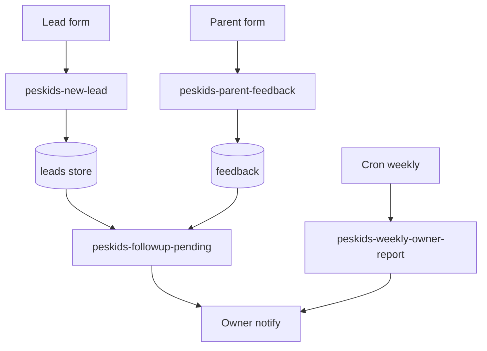

# Peskids — workflows (operación e n8n)

> **Regla:** no editar workflows en VPS desde este doc. Diseño y nombres objetivo; implementación en ventana acordada con owner.

## Inventario base Opsly (ya en catálogo)

CRM Starter Pack (`config/n8n-workflows/catalog.json`):

| ID catálogo | Archivo plantilla | Webhook / trigger |
|-------------|-------------------|-------------------|
| crm-starter-pack | `.n8n/1-workflows/crm/crm-lead-capture.json` | `POST /webhook/opsly-crm-lead` |
| | `crm-hot-lead-alert.json` | `POST /webhook/opsly-crm-hot-lead` |
| | `crm-follow-up-reminder.json` | schedule / internal |
| | `crm-daily-pipeline-digest.json` | schedule |

Instalación referencia: `scripts/install-crm-workflows.sh --tenant peskids` (**solo** con aprobación operativa).

## Workflows Peskids (diseño MVP)

### 1. `peskids-new-lead`

| Campo | Valor |
|-------|--------|
| **Trigger** | Webhook formulario web / manual |
| **Entrada** | nombre, contacto, fuente, mensaje |
| **Pasos** | Validar → dedupe simple (email/tel) → crear lead → actualizar dashboard (sin email auto Sprint 01) |
| **Salida** | Evento lógico `lead.created` (futuro webhook Opsly) |
| **IA** | Opcional: etiquetar fuente/intención — **sugerencia** en notas, no auto-respuesta |

### 2. `peskids-parent-feedback`

| Campo | Valor |
|-------|--------|
| **Trigger** | Form público o enlace portal |
| **Entrada** | parent ref (opcional), rating, comentario, student/class ref |
| **Pasos** | Guardar feedback → status `new` → notificar owner → (opcional) IA resume |
| **Salida** | `feedback.created` |
| **IA** | Resumen y “acción sugerida” — ver [AI-APPROVAL-POLICY.md](./AI-APPROVAL-POLICY.md) |

### 3. `peskids-followup-pending`

| Campo | Valor |
|-------|--------|
| **Trigger** | Schedule diario + eventos (lead sin contacto X días) |
| **Entrada** | Lista follow-ups `pending` |
| **Pasos** | Agrupar por prioridad → email/Discord al owner |
| **Salida** | `followup.pending` (digest) |
| **Humano** | Cierra en hoja/DB; workflow no marca `done` solo |

### 4. `peskids-class-feedback`

| Campo | Valor |
|-------|--------|
| **Trigger** | Form docente post-clase |
| **Entrada** | class_id, teacher_id, notas, rating |
| **Pasos** | Registrar → alertar si rating bajo umbral |
| **MVP+1** | Dashboard docente |

### 5. `peskids-content-idea`

| Campo | Valor |
|-------|--------|
| **Trigger** | Manual (owner/ops) o form interno |
| **Entrada** | título, contexto, canal objetivo |
| **Pasos** | Guardar idea → (opcional) IA borrador → estado `idea` |
| **Salida** | Ninguna publicación automática |

### 6. `peskids-weekly-owner-report`

| Campo | Valor |
|-------|--------|
| **Trigger** | Cron semanal (lunes 08:00 TZ acordada) |
| **Entrada** | Agregados: leads, feedback nuevos, follow-ups abiertos, uptime |
| **Pasos** | Generar HTML/texto → (opcional) IA narrativa → **revisión humana** → envío |
| **Salida** | `report.weekly.generated` |
| **Incluye** | Enlace a n8n/uptime health (lectura) |

## Diagrama de flujo (MVP)

## Variables de entorno (n8n) — nombres estables

Sin valores en repo. Ejemplos de **nombres**:

- `TENANT_SLUG` = `peskids`
- `OPSLY_CRM_NOTIFY_WEBHOOK_URL` — Discord/email gateway
- `PESKIDS_OWNER_EMAIL` — alinear con Doppler, no duplicar en JSON tenant
- `PESKIDS_REPORT_WEBHOOK_URL` — futuro

## Criterios de listo por workflow

| Workflow | Listo cuando |
|----------|----------------|
| new-lead | 1 lead de prueba + notificación recibida |
| parent-feedback | 1 feedback visible para owner |
| followup-pending | 1 recordatorio con cierre manual |
| weekly-report | 1 informe revisado antes de envío |

### 5. `peskids-whatsapp-inbound` (MVP+1 — planificado)

Ver [WHATSAPP-CHANNEL.md](./WHATSAPP-CHANNEL.md).

| Campo | Valor |
|-------|--------|
| **Trigger** | Webhook Jelou o Meta |
| **Pasos** | Validar firma → log mensaje → evento → cola dashboard |
| **Prohibido** | Auto-reply IA; envío sin `approved` |

### 6. `peskids-whatsapp-send-approved` (futuro)

Solo tras aprobación humana en dashboard; plantillas Meta si aplica.

## Qué no automatizar (MVP / Sprint 01)

- Respuestas WhatsApp automáticas (manual en Fase 0; API en fases posteriores con aprobación)
- Publicación en redes
- Cambios en datos de alumnos/padres sin ticket de aprobación
- Suspender/reanudar stacks Docker
